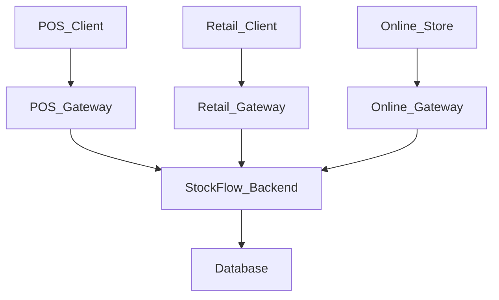

# StockFlow

StockFlow is a multi-channel order and inventory management platform built with a modular monolith architecture. The system supports `Point of Sale (POS)`, `Retail Ordering`, and `Online Ordering` workflows through a shared backend domain model. Centralised inventory and order management enable multiple channels to process transactions simultaneously while maintaining inventory consistency across the platform.

## Project Goals

- Build a scalable multi-channel backend platform
- Centralise inventory and order management
- Support future migration toward microservices
- Explore event-driven architecture patterns
- Practise Kubernetes and cloud-native deployment workflows

## Architecture Overview

StockFlow is designed as a multi-channel backend platform using modular monolith architecture. The system exposes separate channel gateways for `Point of Sale (POS)`, `Retail Ordering`, and `Online Ordering` workflows.

Each gateway acts as an entry point to the system and is responsible for functions such as authentication, request validation and API response handling. The `StockFlow Backend` owns the core business logic, including inventory management, order management and product management.

