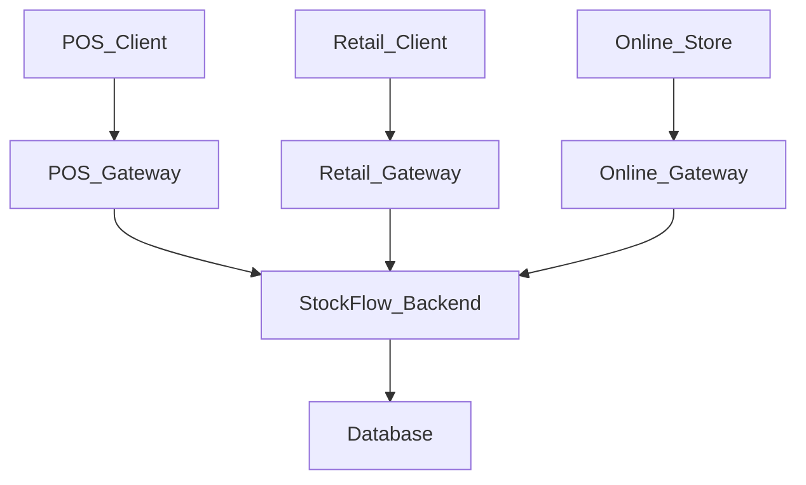

# StockFlow

## Overview

StockFlow is a multi-channel order and inventory management platform built with a modular monolith architecture. The system supports `Point of Sale (POS)`, `Retail Ordering`, and `Online Ordering` workflows through a shared backend domain model. Centralised inventory and order management enable multiple channels to process transactions simultaneously while maintaining inventory consistency across the platform.

## Project Goals

- Build a centralised backend platform that supports multiple ordering channels
- Share inventory across `POS`, `Retail`, and `Online` workflows
- Process orders concurrently across different channels while maintaining inventory consistency
- Design clear module boundaries to support future migration towards microservices
- Explore event-driven architecture patterns as a future extension
- Practise Kubernetes and cloud-native deployment workflows

## Architecture Overview

StockFlow is designed as a multi-channel backend platform using modular monolith architecture. The system exposes separate channel gateways for `Point of Sale (POS)`, `Retail Ordering`, and `Online Ordering` workflows.

Each gateway acts as an entry point to the system and is responsible for functions such as authentication, request validation and API response handling. The `StockFlow Backend` owns the core business logic, including inventory management, order management and product management.

## Core Features

- Supports `POS`, `Retail`, and `Online` ordering workflows through separate channel gateways.
- Maintains a centralised inventory source across all sales channels.
- Creates, tracks, and manages orders from multiple channels.
- Manages products, categories, pricing, and shared product data.
- Supports user accounts, roles, authorities, and permission-based access control.
- Separates external traffic by channel before forwarding requests to the backend application.

