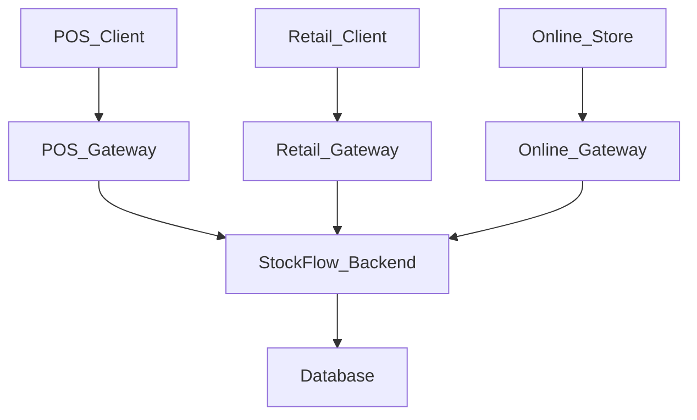

# StockFlow

## Overview

StockFlow is a multi-channel order and inventory management platform built with a modular monolith architecture. The system supports `Point of Sale (POS)`, `Retail Ordering`, and `Online Ordering` workflows through a shared backend domain model. Centralised inventory and order management enable multiple channels to process transactions simultaneously while maintaining inventory consistency across the platform.

## Project Goals

- Build a centralised backend platform that supports multiple ordering channels
- Share inventory across `POS`, `Retail`, and `Online` workflows
- Process orders concurrently across different channels while maintaining inventory consistency
- Design clear module boundaries to support future migration towards microservices
- Explore event-driven architecture patterns as a future extension
- Practise Kubernetes and cloud-native deployment workflows

## Architecture Overview

StockFlow is designed as a multi-channel backend platform using modular monolith architecture. The system exposes separate channel gateways for `Point of Sale (POS)`, `Retail Ordering`, and `Online Ordering` workflows.

Each gateway acts as an entry point to the system and is responsible for functions such as authentication, request validation and API response handling. The `StockFlow Backend` owns the core business logic, including inventory management, order management and product management.

## Core Features

- Supports `POS`, `Retail`, and `Online` ordering workflows through separate channel gateways.
- Maintains a centralised inventory source across all sales channels.
- Creates, tracks, and manages orders from multiple channels.
- Manages products, categories, pricing, and shared product data.
- Supports user accounts, roles, authorities, and permission-based access control.
- Separates external traffic by channel before forwarding requests to the backend application.

## Technical Decisions

- **Modular Monolith Architecture**
  - The system starts as a single backend application to simplify development, testing, and deployment during the early stages of the project.

- **Service Boundaries**
  - The backend application is separated into modules such as inventory, order, product, and authentication. This keeps module responsibilities clear and provides flexibility to extract individual modules into independent microservices in the future if specific services require independent scaling.

- **Multiple Gateways**
  - The system uses separate gateways for `POS`, `Retail`, and `Online` workflows to isolate traffic, apply channel-specific request handling, and avoid exposing the internal backend structure publicly.

- **PostgreSQL as the Primary Database**
  - PostgreSQL supports multiple schemas within a single database, allowing tables to be logically separated by module, such as `inventory`, `product`, `order`, and `authentication`.
  - The system uses a relational database to support structured domain data and transactional consistency.

- **Cloud-Native Deployment**
  - The project is designed to deploy a containerised backend using Docker and Kubernetes to practise production-style infrastructure patterns.

## Status Definitions

The following statuses are used to indicate the current state of documentation sections and related repositories.

| Status | Meaning |
|---|---|
| Active | Currently available and being maintained |
| In Progress | Currently being written, implemented, or updated |
| Planned | Intended for a future phase |

### Documentation Structure

| Section | Description | Status |
|---|---|---|
| `README.md` | Project overview, goals, architecture summary, technical decisions, and documentation navigation | Active |
| `architecture/` | High-level architecture design, gateway design, modular monolith design, and system diagrams | Planned |
| `functional-specifications/` | Functional requirements, business workflows and behaviour | Planned |
| `technical-specifications/` | Technical design details, API design, transaction handling, and concurrency strategy | Planned |
| `database/` | Database schema design, ERD, table relationships, and PostgreSQL schema strategy | Planned |
| `modules/` | Module responsibilities, service boundaries, and ownership of business capabilities | Planned |
| `deployment/` | Docker, Kubernetes, and cloud deployment documentation | Planned |

### Related Repositories

| Repository | Description | Status |
|---|---|---|
| `stockflow-docs` | Project documentation and system design materials | Active |
| `stockflow-backend` | Core backend application using modular monolith architecture | Planned |
| `stockflow-pos-gateway` | Gateway for Point of Sale traffic and POS-specific API handling | Planned |
| `stockflow-retail-gateway` | Gateway for retail ordering traffic and retail-specific API handling | Planned |
| `stockflow-online-gateway` | Gateway for online ordering traffic and online-store API handling | Planned |

