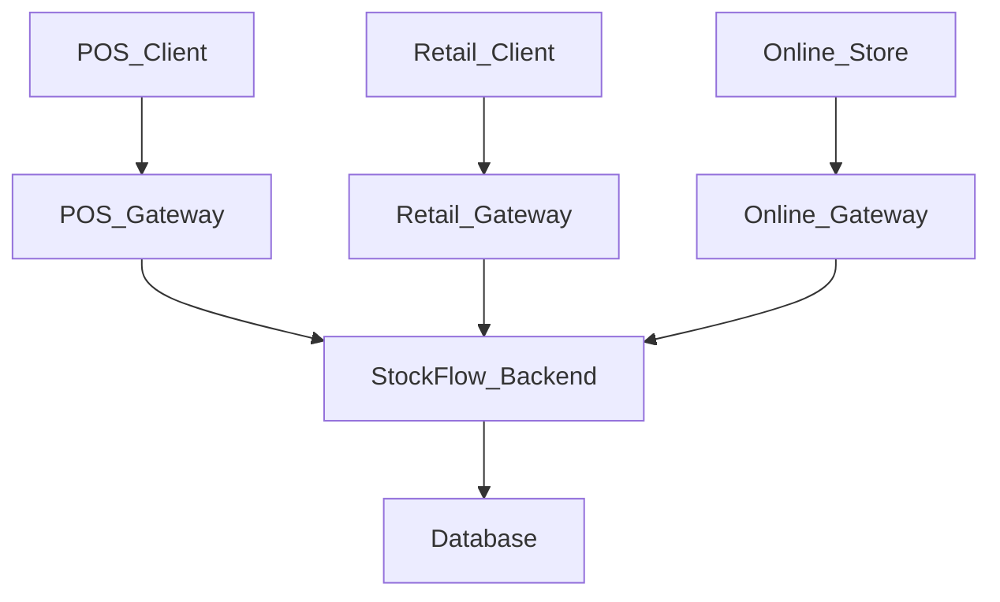

# StockFlow

StockFlow is a multi-channel order and inventory management platform built with a modular monolith architecture. The system supports `Point of Sale (POS)`, `Retail Ordering`, and `Online Ordering` workflows through a shared backend domain model. Centralised inventory and order management enable multiple channels to process transactions simultaneously while maintaining inventory consistency across the platform.

## Project Goals

- Build a centralised backend platform that supports multiple ordering channels
- Share inventory across `POS`, `Retail`, and `Online` workflows
- Process orders concurrently across different channels while maintaining inventory consistency
- Design clear module boundaries to support future migration towards microservices
- Explore event-driven architecture patterns as a future extension
- Practise Kubernetes and cloud-native deployment workflows

## Architecture Overview

StockFlow is designed as a multi-channel backend platform using modular monolith architecture. The system exposes separate channel gateways for `Point of Sale (POS)`, `Retail Ordering`, and `Online Ordering` workflows.

Each gateway acts as an entry point to the system and is responsible for functions such as authentication, request validation and API response handling. The `StockFlow Backend` owns the core business logic, including inventory management, order management and product management.

## Functional Overview

StockFlow provides a shared backend platform for managing orders and inventory across multiple sales channels, including `Point of Sale (POS)`, `Retail Ordering`, and `Online Ordering`.

The platform centralise product, inventory, and order data to ensure that all channels operate against a consistent inventory source. This allows different ordering workflows to process transactions concurrently while maintaining inventory accuracy across the system.

#### Inventory Management

- Track product inventory and stock availability
- Maintain shared inventory across multiple sales channels
- Record inventory movements and stock adjustments
- Support inventory reservation during order processing

#### Order Management

- Create and manage orders from multiple channels
- Support different order workflows and statuses
- Maintain order history and transaction records
- Handle order cancellations and inventory updates

#### Product Management

- Manage products, categories, and pricing
- Support product lookup and product search

#### Authentication and Access Control

- Manage user accounts and authentication
- Support user roles such as `Manager` and `Admin`
- Assign permissions to roles such as `PRODUCT_READ_PERMISSION` and `PRODUCT_DELETE_PERMISSION`
- Protect backend functions based on assigned roles and authorities

#### Gateways

- Provide separate entry points for `POS`, `Retail`, and `Online` workflows
- Support channel specific request handling and validation
- Isolate external traffic from the core backend application

## Technical Overview

StockFlow is built using a modular monolith architecture instead of a distributed microservices architecture to keep development, testing, deployment, and database transactions simpler during the early stages of the project. The system is designed with clear module boundaries so that individual modules can be extracted into independent microservices more easily as the system scales in the future.

The platform serves several channels, including `Point of Sale (POS)`, `Retail Ordering`, and `Online Ordering` workflows. Each gateway is responsible for handling external traffic, request validation, authentication, and channel-specific API processing before forwarding requests to the backend application.

The core of the system provides a shared inventory domain across all ordering channels. This allows multiple gateways to process orders concurrently while maintaining inventory consistency throughout the platform.

