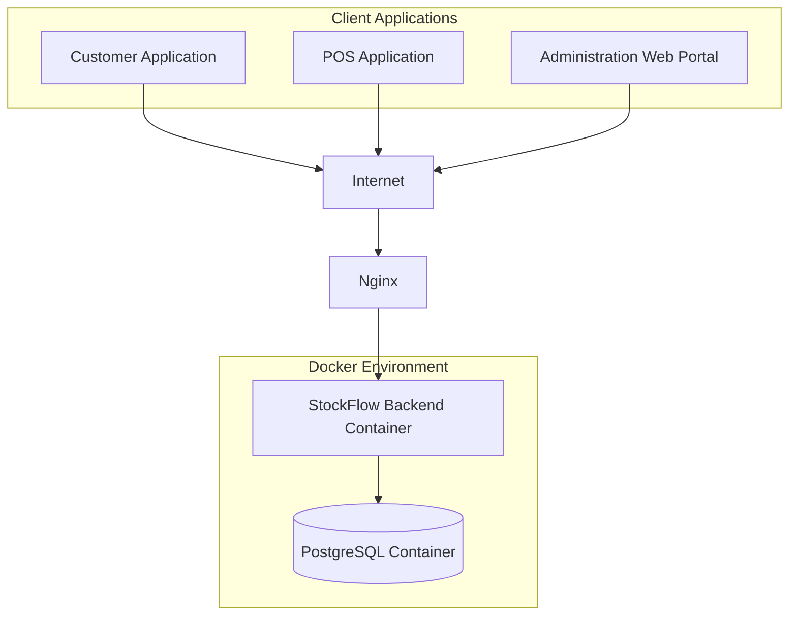
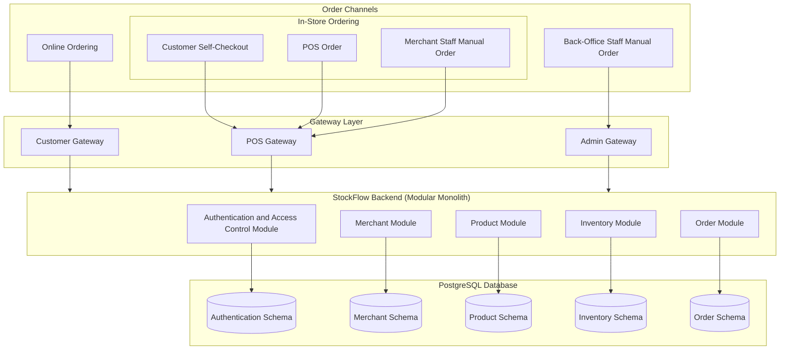

# System Architecture

## Architecture Overview

StockFlow is a multi-tenant order and inventory management platform designed for restaurant and retail merchants. It supports four primary order workflows: `Point of Sale (POS)`, `Online Ordering`, `Self Checkout`, and `Manual`.

StockFlow adopts a modular monolith architecture, where the backend is organised into clearly defined business modules. This architecture reduces development, testing, and deployment complexity during the initial implementation while maintaining clear module boundaries. Each module owns its business responsibilities and communicates with other modules through well-defined application interfaces rather than accessing another module's data directly.

The core business modules are:

- Merchant Management
- Authentication and Access Control
- Product Management
- Inventory Management
- Order Management

All client applications access the platform through dedicated gateways:

- `POS Gateway` - Handles requests from POS devices used by operational staff.
- `Customer Gateway` - Handles customer requests from `Online Ordering` and `Self Checkout`.
- `Admin Gateway` - Handles requests from back-office and merchant staff for administrative and manual operations that are not performed through the POS or customer-facing workflows.

StockFlow uses a shared PostgreSQL database for data storage. Merchant-owned records are associated with a `merchant_id` to ensure that users can only access data belonging to their own merchant organisation. PostgreSQL schemas are used to separate business modules, providing logical boundaries between modules while maintaining a single shared database.

The modular monolith architecture is designed to evolve as the platform grows. Individual modules can be extracted into independent services when scaling, deployment, or operational requirements justify separate ownership, allowing the system to evolve towards a microservices architecture without significant redesign.

## Architecture Diagram

This section provides an overview of the StockFlow system from different architectural perspectives. Each diagram focuses on a specific aspect of the platform, including the overall system structure, the logical organisation of the backend components, and the deployment infrastructure.

- High-Level System Diagram - Illustrates the major components of the platform and how client applications communicate with the backend.
- Logical Architecture - Describes the internal organisation of the StockFlow backend and the relationships between core modules.
- Infrastructure Architecture - Shows how the platform is deployed and the supporting infrastructure used to run the application.

### High-Level System Diagram

The StockFlow platform uses a containerised architecture for its initial deployment. Client applications communicate with the backend through the internet. The `Nginx` acts as the reverse proxy and entry point to the system.

The `StockFlow backend` and `PostgreSQL` database run as Docker containers in the same Docker environment using `docker-compose`. The backend processes business requests and stores application data in `PostgreSQL`.

### Logical Architecture

The StockFlow backend uses a modular monolith architecture, organising the application into independent modules with clear responsibilities. Client requests are routed through dedicated gateway layers based on the order channel before being processed by the appropriate backend modules.

Each module manages its own business logic and stores its data within a dedicated PostgreSQL schema. This provides clear data isolation, improves maintainability, and supports future scalability.

