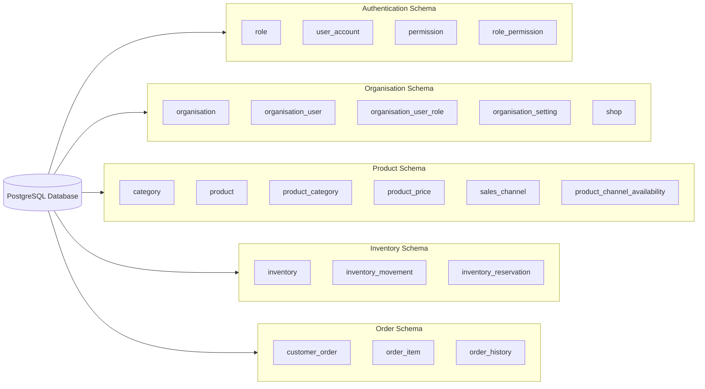

# Database Overview

## Purpose

The purpose of this document is to provide a high-level overview of the StockFlow database design and how data is organised across the platform.

### High-Level Database Structure

The diagram provides a high-level view of the StockFlow database structure and separates database schema to align with the backend modules. Each schema owns the tables responsible for its module, helping maintain clear ownership and separation of concerns.

