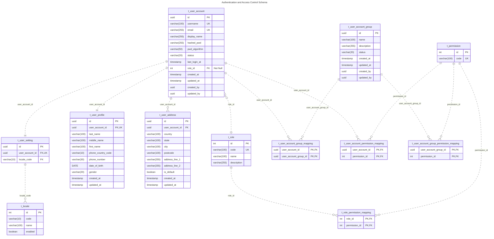

# Authentication ER Diagram

## Table Explanation

This section describes the purpose and relationships of each table in the Authentication and Access Control schema.

### t_user_account

- Each `User Account` is assigned one `Role`
- Each `User Account` can have multiple direct `Permission`
- Each `User Account` has one `User Profile`
- Each `User Account` can have multiple `Address`
- Each `User Account` has one `User Setting`
- Each `User Account` can belong to multiple `User Account Group`

### t_user_account_group

- Each `User Account Group` can contain multiple `User Account`
- Each `User Account` can belong to multiple `User Account Group`
- Each `User Account Group` can be assigned multiple `Permission`, which are inherited by all group members

### t_role

- Each `Role` can be assigned to multiple `User Account`
- Each `Role` can be assigned multiple `Permission`

### t_permission

- A `Permission` can be assigned to multiple `Role`
- A `Permission` can be assigned to multiple `User Account Group`
- A `Permission` can be assigned directly to multiple `User Account`

### t_user_profile

- Each `User Profile` belongs to one `User Account`

### t_user_address

- Each `Address` belongs to one `User Account`
- A `User Account` can have multiple `Address`

### t_user_setting

- Each `User Setting` belongs to one `User Account`
- Each `User Setting` references one preferred `Locale`

### t_locale

- `code` stores the locale identifier
- `name` stores the locale description
- `enabled` indicates whether the locale is available for selection

Examples:

| code | name |
|---------|---------|
| `en-GB` | English (United Kingdom) |
| `zh-HK` | Tradition Chinese (Hong Kong) |

