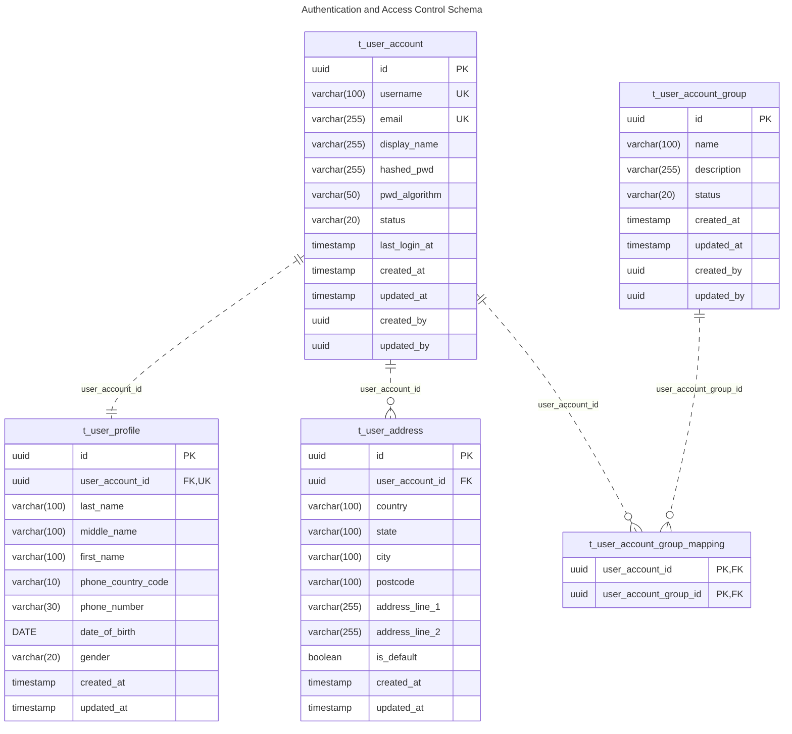

# Authentication ER Diagram

```mermaid
---
title: Authentication and Access Control Schema
---
erDiagram
    t_user_account {
        uuid id PK
        varchar(100) username UK
        varchar(255) email UK
        
        varchar(255) display_name
        varchar(255) hashed_pwd
        varchar(50) pwd_algorithm
        
        varchar(20) status
        timestamp last_login_at
        
        timestamp created_at
        timestamp updated_at
        uuid created_by
        uuid updated_by
    }

    t_user_profile {
        uuid id PK
        uuid user_account_id FK, UK
        
        varchar(100) last_name
        varchar(100) middle_name
        varchar(100) first_name
        
        varchar(10) phone_country_code
        varchar(30) phone_number
        
        DATE date_of_birth
        varchar(20) gender
        
        timestamp created_at
        timestamp updated_at
    }
    t_user_account ||..|| t_user_profile : user_account_id

    t_user_address {
        uuid id PK
        uuid user_account_id FK

        varchar(100) country
        varchar(100) state
        varchar(100) city
        varchar(100) postcode

        varchar(255) address_line_1
        varchar(255) address_line_2

        boolean is_default

        timestamp created_at
        timestamp updated_at
    }
    t_user_account ||..o{ t_user_address : user_account_id

    t_user_account_group {
        uuid id PK

        varchar(100) name
        varchar(255) description
        
        varchar(20) status

        timestamp created_at
        timestamp updated_at
        uuid created_by
        uuid updated_by
    }

    t_user_account_group_mapping {
        uuid user_account_id PK, FK
        uuid user_account_group_id PK, FK
    }

    t_user_account ||..o{ t_user_account_group_mapping : user_account_id
    t_user_account_group ||..o{ t_user_account_group_mapping : user_account_group_id


```
