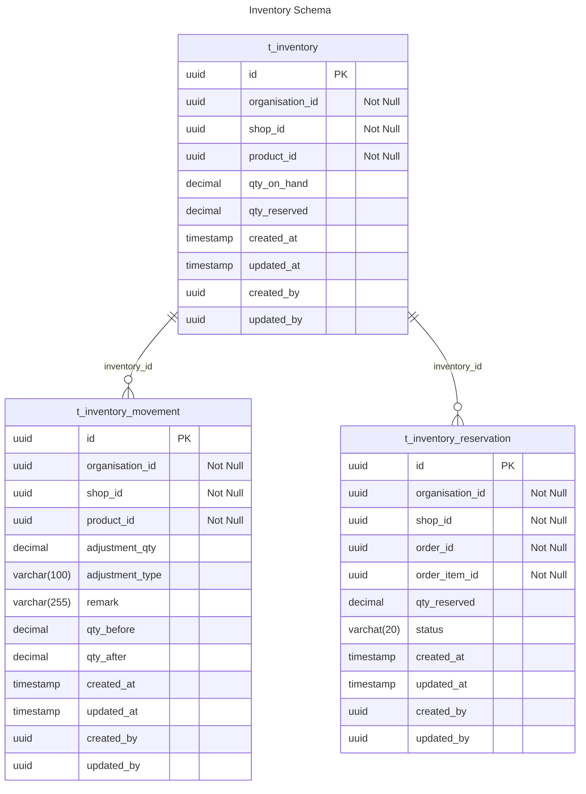

# Inventory ER Diagram

## Table Explanation

This section describes the purpose and relationships of each table in the Inventory schema.

### t_inventory

- Each `Inventory` can have multiple `Inventory Movement`
- Each `Inventory` can have multiple `Inventory Reservation`

### t_inventory_movement

- Each `Inventory Movement` belongs to one `Inventory`

### t_inventory_reservation

- Each `Inventory Reservation` belongs to one `Inventory`

