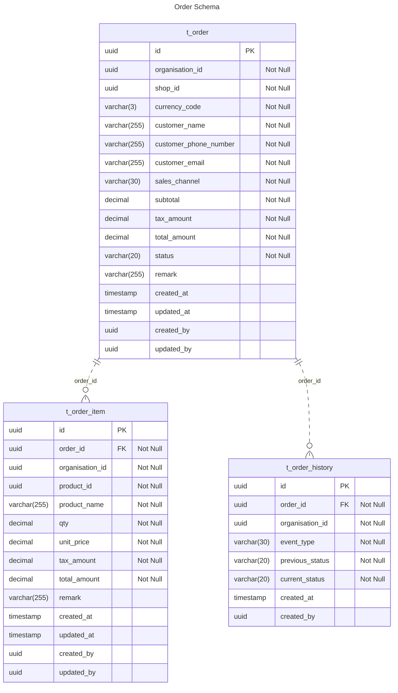

# Order ER Diagram

## Table Explanation

This section describes the purpose and relationships of each table in the Order schema.

```mermaid
---
title: Order Schema
---
erDiagram

    t_order {
        uuid id PK
        
        uuid organisation_id "Not Null"
        uuid shop_id "Not Null"
        varchar(3) currency_code "Not Null"

        varchar(255) customer_name "Not Null"
        varchar(255) customer_phone_number "Not Null"
        varchar(255) customer_email "Not Null"

        varchar(30) sales_channel "Not Null"        
        decimal subtotal "Not Null"
        decimal tax_amount "Not Null"
        decimal total_amount "Not Null"
        varchar(20) status "Not Null"
        varchar(255) remark

        timestamp created_at
        timestamp updated_at
        uuid created_by
        uuid updated_by        
    }

    t_order_item {
        uuid id PK
        uuid order_id FK "Not Null"

        uuid organisation_id "Not Null"
        uuid product_id "Not Null"

        varchar(255) product_name "Not Null"
        decimal qty "Not Null"
        decimal unit_price "Not Null"
        decimal tax_amount "Not Null"
        decimal total_amount "Not Null"
        varchar(255) remark

        timestamp created_at
        timestamp updated_at
        uuid created_by
        uuid updated_by  
    }
    t_order ||..o{ t_order_item : order_id

    t_order_history {
        uuid id PK
        uuid order_id FK "Not Null"

        uuid organisation_id "Not Null"
        
        varchar(30) event_type "Not Null"
        varchar(20) previous_status "Not Null"
        varchar(20) current_status "Not Null"

        timestamp created_at
        uuid created_by 
    }
    t_order ||..o{ t_order_history : order_id


```