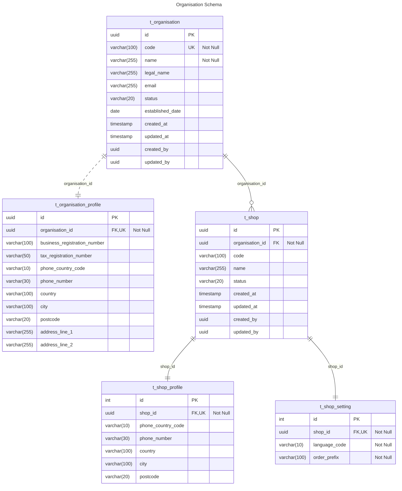

```mermaid
---
title: Organisation Schema
---
erDiagram

    t_organisation {
        uuid id PK

        varchar(100) code UK "Not Null"
        varchar(255) name "Not Null"
        varchar(255) legal_name
        varchar(255) email

        varchar(20) status
        date established_date

        timestamp created_at
        timestamp updated_at
        uuid created_by
        uuid updated_by
    }

    t_organisation_profile {
        uuid id PK
        uuid organisation_id FK, UK "Not Null"

        varchar(100) business_registration_number
        varchar(50) tax_registration_number

        varchar(10) phone_country_code
        varchar(30) phone_number

        varchar(100) country
        varchar(100) city
        varchar(20) postcode

        varchar(255) address_line_1
        varchar(255) address_line_2


    }
    t_organisation ||..|| t_organisation_profile : organisation_id

    t_shop {
        uuid id PK
        uuid organisation_id FK "Not Null"

        varchar(100) code
        varchar(255) name
        varchar(20) status

        timestamp created_at
        timestamp updated_at
        uuid created_by
        uuid updated_by
    }
    t_organisation ||--o{ t_shop : organisation_id

    t_shop_profile {
        int id PK
        uuid shop_id FK, UK "Not Null"

        varchar(10) phone_country_code
        varchar(30) phone_number

        varchar(100) country
        varchar(100) city
        varchar(20) postcode

    }
    t_shop ||--|| t_shop_profile : shop_id

    t_shop_setting {
        int id PK
        uuid shop_id FK, UK "Not Null"

        varchar(10) language_code "Not Null"
        varchar(100) order_prefix "Not Null"

    }
    t_shop ||--|| t_shop_setting : shop_id

```