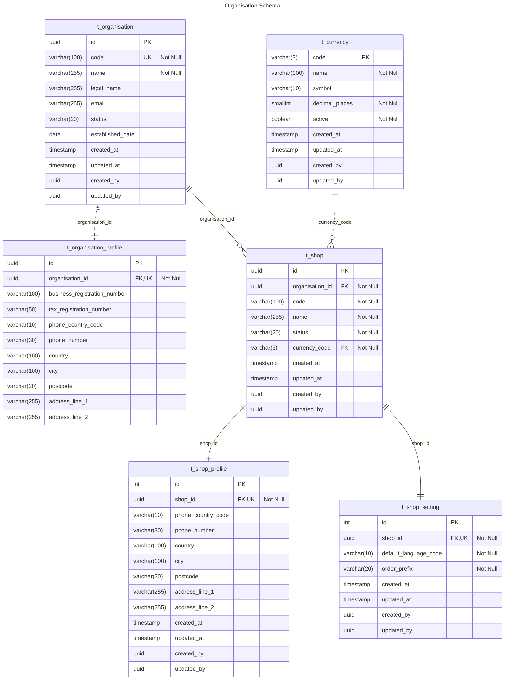

# Organisation ER Diagram

## Table Explanation

This section describes the purpose and relationships of each table in the Organisation schema.

### t_organisation

- Each `Organisation` has one `Organisation Profile`
- Each `Organisation` can have multiple `Shop`

### t_organisation_profile

- Each `Organisation Profile` belongs to one `Organisation`

### t_shop

- Each `Shop` belongs to one `Organisation`
- Each `Shop` has one `Shop Profile`
- Each `Shop` has one `Shop Setting`

### t_shop_profile

- Each `Shop Profile` belongs to one `Shop`

### t_shop_setting

- Each `Shop Setting` belongs to one `Shop`

