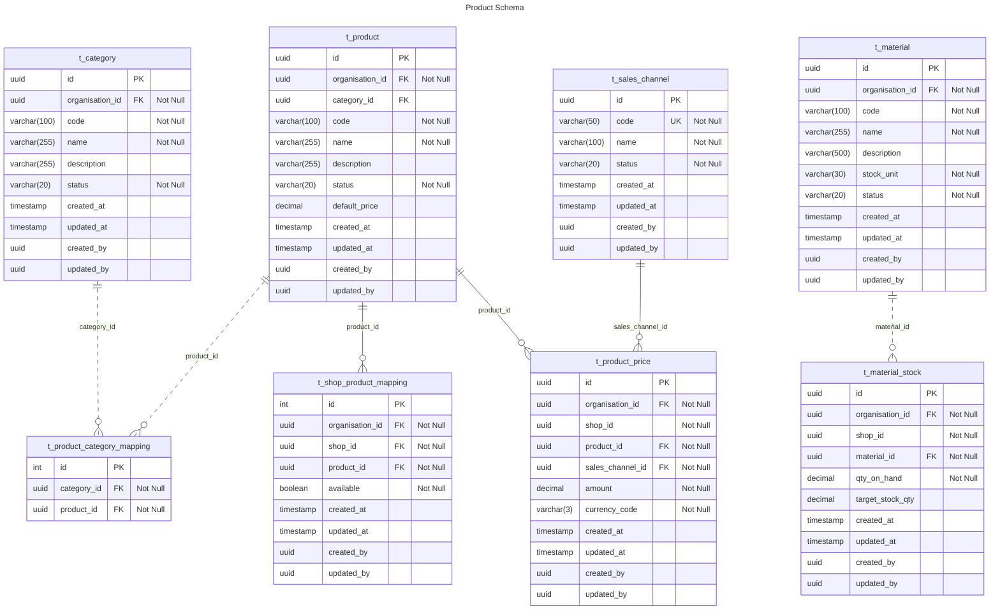

```mermaid
---
title: Product Schema
---
erDiagram

    t_category {
        uuid id PK
        uuid organisation_id FK "Not Null"

        varchar(100) code "Not Null"
        varchar(255) name "Not Null"
        varchar(255) description
        varchar(20) status "Not Null"

        timestamp created_at
        timestamp updated_at
        uuid created_by
        uuid updated_by        
    }

    t_product {
        uuid id PK
        uuid organisation_id FK "Not Null"
        uuid category_id FK

        varchar(100) code "Not Null"
        varchar(255) name "Not Null"
        varchar(255) description
        varchar(20) status "Not Null"

        decimal default_price

        timestamp created_at
        timestamp updated_at
        uuid created_by
        uuid updated_by
    }
    
    t_shop_product_mapping {
        int id PK

        uuid organisation_id FK "Not Null"
        uuid shop_id FK "Not Null"
        uuid product_id FK "Not Null"
        
        boolean available "Not Null"

        timestamp created_at
        timestamp updated_at
        uuid created_by
        uuid updated_by
    }
    t_product ||--o{ t_shop_product_mapping : product_id

    t_product_price {
        uuid id PK
        uuid organisation_id FK "Not Null"
        uuid shop_id "Not Null"
        
        uuid product_id FK "Not Null"
        uuid sales_channel_id FK "Not Null"

        decimal amount "Not Null"
        varchar(3) currency_code "Not Null"

        timestamp created_at
        timestamp updated_at
        uuid created_by
        uuid updated_by
    }
    t_product ||--o{ t_product_price : product_id

    t_sales_channel {
        uuid id PK

        varchar(50) code UK "Not Null"
        varchar(100) name "Not Null"
        varchar(20) status "Not Null"

        timestamp created_at
        timestamp updated_at
        uuid created_by
        uuid updated_by
    }
    t_sales_channel ||--o{ t_product_price : sales_channel_id

    t_product_category_mapping {
        int id PK
        uuid category_id FK "Not Null"
        uuid product_id FK "Not Null"
    }

    t_category ||..o{ t_product_category_mapping : category_id
    t_product ||..o{ t_product_category_mapping : product_id

    t_material {
        uuid id PK
        uuid organisation_id FK "Not Null"

        varchar(100) code "Not Null"
        varchar(255) name "Not Null"
        varchar(500) description

        varchar(30) stock_unit "Not Null"
        varchar(20) status "Not Null"

        timestamp created_at
        timestamp updated_at
        uuid created_by
        uuid updated_by        
    }

    t_material_stock {
        uuid id PK

        uuid organisation_id FK "Not Null"
        uuid shop_id "Not Null"

        uuid material_id FK "Not Null"

        decimal qty_on_hand "Not Null"
        decimal target_stock_qty

        timestamp created_at
        timestamp updated_at
        uuid created_by
        uuid updated_by        
    }
    t_material ||..o{ t_material_stock : material_id
```