# Product ER Diagram

## Table Explanation

This section describes the purpose and relationships of each table in the Product schema.

### t_category

- Each `Category` can have multiple `Product`
- Each `Category` can have multiple `Category Translation`

### t_category_translation

- Each `Category Translation` belongs to one `Category`

### t_product

- A `Product` can be assigned to multiple `Category`
- A `Product` can be assigned to multiple `Shop`
- Each `Product` can have multiple `Product Price`
- Each `Product` can have multiple `Product Translation`

### t_product_price

- Each `Product Price` belongs to one `Product`
- Each `Product Price` belongs to one `Sales Channel`

### t_product_translation

- Each `Product Translation` belongs to one `Product`

### t_sales_channel

- Each `Sales Channel` can have multiple `Product Price`

### t_material

- Each `Material` can have multiple `Material Stock`
- Each `Material` can have multiple `Material Translation`

### t_material_stock

- Each `Material Stock` belongs to one `Material`

### t_material_translation

- Each `Material Translation` belongs to one `Material`

```mermaid
---
title: Product Schema
---
erDiagram

    t_category {
        uuid id PK
        uuid organisation_id "Not Null"

        varchar(100) code "Not Null"
        varchar(20) status "Not Null"

        timestamp created_at
        timestamp updated_at
        uuid created_by
        uuid updated_by
    }

    t_category_translation {
        uuid id PK
        uuid category_id FK "Not Null"

        uuid organisation_id "Not Null"

        varchar(10) language_code "Not Null"
        varchar(255) name "Not Null"
        varchar(255) description

        timestamp created_at
        timestamp updated_at
        uuid created_by
        uuid updated_by
    }
    t_category ||..o{ t_category_translation : category_id

    t_product {
        uuid id PK
        uuid organisation_id "Not Null"

        varchar(100) code "Not Null"        
        varchar(20) status "Not Null"

        decimal default_price

        timestamp created_at
        timestamp updated_at
        uuid created_by
        uuid updated_by
    }

    t_product_translation {
        uuid id PK
        uuid product_id FK "Not Null"

        uuid organisation_id "Not Null"

        varchar(10) language_code "Not Null"
        varchar(255) name "Not Null"
        varchar(255) description

        timestamp created_at
        timestamp updated_at
        uuid created_by
        uuid updated_by
    }
    t_product ||..o{ t_product_translation : product_id

    t_product_category_mapping {
        int id PK
        uuid category_id FK "Not Null"
        uuid product_id FK "Not Null"
    }
    t_category ||..o{ t_product_category_mapping : category_id
    t_product ||..o{ t_product_category_mapping : product_id
    
    t_shop_product_mapping {
        int id PK

        uuid organisation_id "Not Null"
        uuid shop_id "Not Null"
        uuid product_id FK "Not Null"
        
        boolean available "Not Null"

        timestamp created_at
        timestamp updated_at
        uuid created_by
        uuid updated_by
    }
    t_product ||--o{ t_shop_product_mapping : product_id

    t_product_price {
        uuid id PK
        uuid organisation_id "Not Null"
        uuid shop_id "Not Null"
        
        uuid product_id FK "Not Null"
        uuid sales_channel_id FK "Not Null"

        decimal amount "Not Null"

        timestamp created_at
        timestamp updated_at
        uuid created_by
        uuid updated_by
    }
    t_product ||--o{ t_product_price : product_id

    t_sales_channel {
        uuid id PK

        varchar(50) code UK "Not Null"
        varchar(100) name "Not Null"
        varchar(20) status "Not Null"

        timestamp created_at
        timestamp updated_at
        uuid created_by
        uuid updated_by
    }
    t_sales_channel ||--o{ t_product_price : sales_channel_id

    t_material {
        uuid id PK
        uuid organisation_id "Not Null"

        varchar(100) code "Not Null"

        varchar(30) stock_unit "Not Null"
        varchar(20) status "Not Null"

        timestamp created_at
        timestamp updated_at
        uuid created_by
        uuid updated_by
    }

    t_material_translation {
        uuid id PK
        uuid material_id FK "Not Null"

        uuid organisation_id "Not Null"

        varchar(10) language_code "Not Null"
        varchar(255) name "Not Null"
        varchar(255) description

        timestamp created_at
        timestamp updated_at
        uuid created_by
        uuid updated_by
    }
    t_material ||..o{ t_material_translation : material_id

    t_material_stock {
        uuid id PK

        uuid organisation_id "Not Null"
        uuid shop_id "Not Null"

        uuid material_id FK "Not Null"

        decimal qty_on_hand "Not Null"
        decimal target_stock_qty

        timestamp created_at
        timestamp updated_at
        uuid created_by
        uuid updated_by
    }
    t_material ||..o{ t_material_stock : material_id
```

