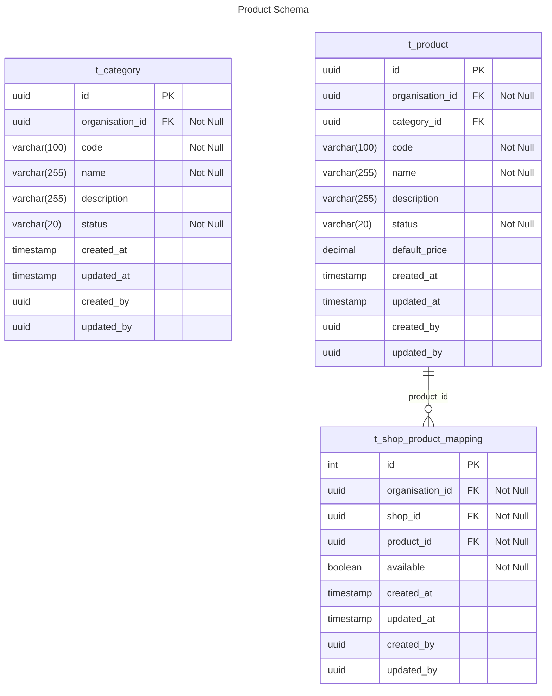

```mermaid
---
title: Product Schema
---
erDiagram

    t_category {
        uuid id PK
        uuid organisation_id FK "Not Null"

        varchar(100) code "Not Null"
        varchar(255) name "Not Null"
        varchar(255) description
        varchar(20) status "Not Null"

        timestamp created_at
        timestamp updated_at
        uuid created_by
        uuid updated_by        
    }

    t_product {
        uuid id PK
        uuid organisation_id FK "Not Null"
        uuid category_id FK

        varchar(100) code "Not Null"
        varchar(255) name "Not Null"
        varchar(255) description
        varchar(20) status "Not Null"

        decimal default_price


        timestamp created_at
        timestamp updated_at
        uuid created_by
        uuid updated_by
    }
    
    t_shop_product_mapping {
        int id PK

        uuid organisation_id FK "Not Null"
        uuid shop_id FK "Not Null"
        uuid product_id FK "Not Null"
        
        boolean available "Not Null"

        timestamp created_at
        timestamp updated_at
        uuid created_by
        uuid updated_by
    }
    t_product ||--o{ t_shop_product_mapping : product_id

```