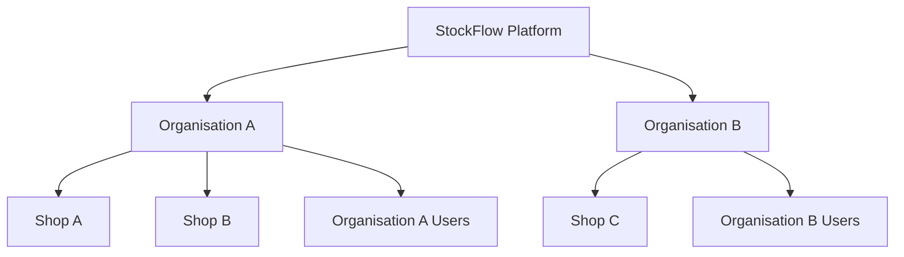

# Authentication and Access Control

## Purpose

The purpose of Authentication and Access Control is to ensure that users can access the platform securely and only perform actions that match their assigned responsibilities. StockFlow supports different types of users, including platform-level users, organisation owners, shop managers, shop staff, and customers, each with different access requirements.

## Scope

Authentication and Access Control provides the following capabilities for StockFlow.

### Initial Scope

- User account creation and management
- User group creation and management
- User login and logout
- Password reset and password change workflows
- Role-based access control
- Authority-based permission checks
- Assignment of roles to users
- Assignment of authorities to roles
- Organisation data isolation to prevent unauthorised access to another organisation's data

### Future Scope

- User account activation and deactivation

## Access Control

StockFlow uses `Users`, `Roles`, `Authorities`, and `User Groups` to manage access across the platform and individual organisations. These components define who can access the system, what actions they are permitted to perform, and which organisation or business data they are allowed to access.

### Users

A user represents an individual who can access StockFlow.

Users may include platform operators, organisation owners, shop employees, and customers. Each user has an account and may be assigned roles, authorities through roles, and user group memberships.

Key user capabilities include:

- Creating and managing user accounts
- Associating users with an organisation and assigning access to one or more shops where applicable
- Assigning one or more roles to a user
- Adding users to one or more user groups
- Updating user account information
- Preventing users from accessing data outside their permitted scope

### User Groups

A user group represents a collection of users who share a common business function, team, department, location, or operational responsibility.

User groups help organisations organise users and apply common access settings more efficiently.

Examples of user groups include:

- Shop Managers
- POS Staff
- Customer Support

Key user group capabilities include:

- Creating and maintaining user groups
- Adding users to a user group
- Removing users from a user group
- Associating a user group with an organisation

### Roles

A role groups related authorities under a named business responsibility, such as `Shop Manager`. Roles can be reused by assigning them to multiple users with similar responsibilities.

Initial roles include:

- `Platform Owner`
- `Organisation Owner`
- `Shop Manager`
- `Shop Staff`
- `Customer`

Key role management capabilities include:

- Creating and maintaining roles
- Assigning roles to users
- Removing roles from users
- Assigning authorities to roles
- Preventing users from assigning roles above their own permitted access level

### Authorities

Authorities represent specific actions that a user is permitted to perform within StockFlow. They can be grouped by business capability to make access control easier to organise and maintain.

Authorities are normally assigned to roles, and users receive the relevant permissions through their assigned roles.

Authority categories include:

- Product management
- Inventory management
- Order management
- User and role management
- Organisation administration

Initial authorities include:

- `PRODUCT_CREATE`
- `PRODUCT_READ`
- `INVENTORY_READ`
- `SHOP_ORDER_CREATE`
- `CUSTOMER_ORDER_READ_SELF`
- `PLATFORM_USER_CREATE`
- `ORGANISATION_USER_UPDATE`
- `ORGANISATION_ROLE_ASSIGN`

## User Roles

StockFlow defines user roles for both platform-level users and users within organisations. Each role is associated with a set of authorities that determines which functions and data the user is permitted to access.

### Platform Owner

The `Platform Owner` is responsible for operating and administering the StockFlow platform.

Main responsibilities include:

- Creating and managing organisation accounts
- Viewing platform-level organisation information
- Managing organisation access to the platform
- Managing platform-level roles and authorities
- Reviewing platform operations and organisation support requirements
- Accessing platform administration functions

### Organisation Owner

The `Organisation Owner` is responsible for administering the business organisation using StockFlow.

Main responsibilities include:

- Managing the organisation profile
- Creating and managing shops
- Managing organisation users and shop access
- Assigning organisation-level and shop-level roles
- Managing products, categories, and catalogues
- Reviewing inventory and orders across permitted shops
- Accessing organisation-wide operational information

### Shop Manager

The `Shop Manager` is responsible for managing the day-to-day operations of a business.

Main responsibilities include:

- Creating and updating products
- Managing product categories and catalogue assignments
- Reviewing inventory availability
- Updating or adjusting inventory where permitted
- Reviewing incoming orders
- Confirming, modifying, or cancelling eligible orders
- Monitoring operational order and stock information
- Supporting shop staff during daily operations

### Shop Staff

The `Shop Staff` role represents employees responsible for day-to-day operational tasks such as processing orders.

Main responsibilities include:

- Processing `POS` orders
- Viewing product and catalogue information
- Checking inventory availability
- Viewing and updating eligible orders where permitted
- Supporting customer checkout

### Customer

The `Customer` is an external user who purchases products from an organisation through customer-facing ordering workflows.

Main responsibilities include:

- Registering and managing a customer account
- Browsing products available through supported catalogues
- Adding, updating, and removing items from a shopping cart
- Placing orders through online, retail, or restaurant ordering workflows
- Viewing the status and details of their own orders
- Managing their own account and delivery or collection information
- Cancelling eligible orders where permitted by the organisation's cancellation rules

## Functional Capabilities

The Authentication and Access Control module provides the following capabilities for managing user accounts, authentication, roles, authorities, and user groups within StockFlow.

- User account management
    * Create user account
    * View and update user account information
- User authentication
    * Login and logout
    * Change password
    * Reset password
- Role management
    * Create roles
    * Assign roles to users
    * View roles assigned to users
    * Disable roles
    * Remove roles from users
- Authority management
    * Create authorities
    * View authorities
    * Assign authorities to roles
    * Remove authorities from roles
- User group management
    * Create user groups
    * Add users to user groups
    * Remove users from user groups
    * Associate user groups with an organisation

## Business Workflows

The following workflows describe the main steps involved in user account management, authentication, role and authority management, user group management, and access control within StockFlow.

### User Account Workflows

#### User Account Creation Workflow

- A new user account is created through one of the following methods:
  - A `Customer` creates their own account without requiring an authorised user
  - An authorised user creates an account for a platform-level or organisation-level user
- StockFlow validates the submitted account information
- StockFlow creates the account:
  - A customer account is created without an organisation association
  - An organisation-level account is associated with the relevant organisation
  - A platform-level account is created without an organisation association
- Predefined roles or user groups may be assigned where applicable

#### User Account Viewing and Update Workflow

- A user requests to view their own account information
- StockFlow returns the account information when the request is permitted
- The user may submit changes to editable account information
- StockFlow validates the submitted changes and the user’s permission to make them
- StockFlow saves the changes when validation succeeds

#### User Login Workflow

- A user submits their account credentials
- StockFlow verifies the credentials and account status
- StockFlow identifies the user’s assigned roles, authorities, user groups, organisation membership, and permitted shop access
- Access is granted when authentication succeeds and the account is permitted to access StockFlow
- Access is denied when authentication fails or the account is not permitted to log in

#### User Logout Workflow

- A user requests to end their current authenticated session
- StockFlow invalidates or removes the corresponding session
- The user must authenticate again before accessing protected functions

#### Password Change Workflow

- An authenticated user submits their current password and a new password
- StockFlow verifies the current password and validates the new password
- StockFlow updates the user’s credentials when validation succeeds

#### Password Reset Workflow

- A user requests a password reset
- StockFlow verifies the account and initiates the password-reset process
- The user completes the required verification
- The user submits a new password
- StockFlow validates and saves the new password
- Any expired or previously used reset request is rejected

### Role Workflows

#### Role Creation Workflow

- An authorised user creates a role to represent a business responsibility
- The user provides a role name and description
- StockFlow validates the role information and the user’s permission
- StockFlow saves the role within the permitted platform or organisation scope

#### Role Assignment to User Workflow

- An authorised user selects a user and a role
- StockFlow verifies that the requesting user is permitted to assign the selected role
- StockFlow verifies that the selected role and user belong to a compatible access scope
- StockFlow assigns the role to the user

#### Role Removal from User Workflow

- An authorised user selects a role assigned to a user
- StockFlow verifies the requesting user’s permission
- StockFlow removes the role from the user

#### View User Roles Workflow

- An authorised user requests to view the roles assigned to a selected user
- StockFlow verifies the requesting user’s permission and data scope
- StockFlow returns the assigned roles when access is permitted

#### Role Disablement Workflow

- An authorised user requests to disable a role
- StockFlow verifies the requesting user’s permission
- StockFlow marks the role as disabled
- The disabled role cannot be assigned to additional users
- Existing role assignments are handled according to the applicable business rules

### Authority Workflows

#### Authority Creation Workflow

- An authorised platform-level user creates an authority
- The user provides the authority name, description, and relevant capability category
- StockFlow validates the authority information
- StockFlow saves the authority

#### View Authorities Workflow

- An authorised user requests to view available authorities
- StockFlow verifies the requesting user’s permission and access scope
- StockFlow returns the authorities that the user is permitted to view

#### Authority Assignment to Role Workflow

- An authorised user selects a role and one or more authorities
- StockFlow verifies that the user is permitted to manage the selected role and authorities
- StockFlow assigns the authorities to the role

#### Authority Removal from Role Workflow

- An authorised user selects one or more authorities assigned to a role
- StockFlow verifies the requesting user’s permission
- StockFlow removes the selected authorities from the role

### User Group Workflows

#### User Group Creation Workflow

- An authorised organisation-level user creates a user group for a team, department, location, or operational responsibility
- StockFlow verifies the requesting user’s permission
- StockFlow associates the user group with the relevant organisation
- StockFlow saves the user group

#### Add User to User Group Workflow

- An authorised user selects a user and a user group
- StockFlow verifies the requesting user’s permission
- StockFlow verifies that the user and user group belong to the same organisation
- StockFlow adds the user to the group

#### Remove User from User Group Workflow

- An authorised user selects a member of a user group
- StockFlow verifies the requesting user’s permission
- StockFlow removes the user from the group

#### Associate User Group with Organisation Workflow

- An authorised user associates a user group with an organisation
- StockFlow verifies the requesting user’s permission
- StockFlow ensures that the group and its members remain within the permitted organisation scope
- StockFlow prevents the group from containing users associated with another organisation

### Shared Access Control Workflows

#### Protected Function Access Workflow

- An authenticated user requests access to a protected function
- StockFlow verifies the user’s authentication status
- StockFlow checks the user’s assigned roles and associated authorities
- StockFlow verifies the user’s organisation membership, permitted shop access, and data scope where applicable
- StockFlow allows the request only when all required access conditions are satisfied
- StockFlow denies the request when any required condition is not satisfied

#### Organisation Data Isolation Workflow

- An organisation-level user requests access to organisation-owned data
- StockFlow identifies the organisation associated with the authenticated user
- StockFlow verifies that the requested data belongs to the same organisation
- StockFlow restricts the request to data belonging to the user’s organisation
- StockFlow denies access to data belonging to another organisation
- StockFlow verifies that the user is permitted to access the requested shop where shop-level access is required

#### Restricted Role Assignment Workflow

- A user attempts to assign a role to another user
- StockFlow checks the requesting user’s roles, authorities, and access scope
- StockFlow checks whether the requesting user is permitted to assign the selected role
- StockFlow rejects the assignment when the selected role exceeds the requesting user’s permitted level
- StockFlow also rejects the assignment when the users or role belong to incompatible platform, organisation, or shop scopes

#### Unauthorised Access Handling Workflow

- A user attempts to access a function or data without the required authority or permitted data scope
- StockFlow denies the request
- StockFlow returns an appropriate access-denied response without exposing restricted information
- StockFlow records the unauthorised access attempt when required for security and audit purposes

## Role and Authority Matrix

The following matrix defines the default authorities assigned to each predefined StockFlow role.

An assigned authority permits a user to perform the corresponding action or operation. Organisation-level roles and authorities are restricted to the organisation in which they are defined and assigned.

### Platform User Management Authorities

| Authority | Platform Owner | Organisation Owner | Shop Manager | Shop Staff | Customer |
|---|---:|---:|---:|---:|---:|
| `PLATFORM_USER_CREATE` | ✓ | - | - | - | - |
| `PLATFORM_USER_READ` | ✓ | - | - | - | - |
| `PLATFORM_USER_UPDATE` | ✓ | - | - | - | - |
| `PLATFORM_USER_DISABLE` | ✓ | - | - | - | - |
| `PLATFORM_USER_DELETE` | ✓ | - | - | - | - |

### Organisation User Management Authorities

| Authority | Platform Owner | Organisation Owner | Shop Manager | Shop Staff | Customer |
|---|---:|---:|---:|---:|---:|
| `ORGANISATION_USER_CREATE` | ✓ | ✓ | - | - | - |
| `ORGANISATION_USER_READ` | ✓ | ✓ | ✓ | - | - |
| `ORGANISATION_USER_UPDATE` | ✓ | ✓ | - | - | - |
| `ORGANISATION_USER_DISABLE` | ✓ | ✓ | - | - | - |
| `SHOP_USER_ASSIGN` | ✓ | ✓ | - | - | - |
| `SHOP_USER_REMOVE` | ✓ | ✓ | - | - | - |
| `SHOP_USER_ACCESS_READ` | ✓ | ✓ | - | - | - |

- Shop Managers may view or update organisation user information only when the required authority has been assigned and the user is associated with a shop within the manager’s permitted scope

### Customer Account Management Authorities

| Authority | Platform Owner | Organisation Owner | Shop Manager | Shop Staff | Customer |
|---|---:|---:|---:|---:|---:|
| `CUSTOMER_ACCOUNT_READ` | ✓ | - | - | - | - |
| `CUSTOMER_ACCOUNT_UPDATE` | ✓ | - | - | - | - |
| `CUSTOMER_ACCOUNT_READ_SELF` | - | - | - | - | ✓ |
| `CUSTOMER_ACCOUNT_UPDATE_SELF` | - | - | - | - | ✓ |
| `CUSTOMER_ACCOUNT_DISABLE` | ✓ | - | - | - | - |
| `CUSTOMER_ACCOUNT_DELETE` | ✓ | - | - | - | - |

- A `Customer` can create and manage only their own account
- `Customer` accounts belong to the StockFlow platform rather than a specific organisation. A `Customer` may use services provided by multiple organisations through a single account

### Role Management Authorities

| Authority | Platform Owner | Organisation Owner | Shop Manager | Shop Staff | Customer |
|---|---:|---:|---:|---:|---:|
| `PLATFORM_ROLE_CREATE` | ✓ | - | - | - | - |
| `PLATFORM_ROLE_READ` | ✓ | - | - | - | - |
| `PLATFORM_ROLE_UPDATE` | ✓ | - | - | - | - |
| `PLATFORM_ROLE_ASSIGN` | ✓ | - | - | - | - |
| `PLATFORM_ROLE_REMOVE` | ✓ | - | - | - | - |
| `PLATFORM_ROLE_DISABLE` | ✓ | - | - | - | - |
| `ORGANISATION_ROLE_CREATE` | ✓ | ✓ | - | - | - |
| `ORGANISATION_ROLE_READ` | ✓ | ✓ | ✓ | - | - |
| `ORGANISATION_ROLE_UPDATE` | ✓ | ✓ | - | - | - |
| `ORGANISATION_ROLE_ASSIGN` | ✓ | ✓ | - | - | - |
| `ORGANISATION_ROLE_REMOVE` | ✓ | ✓ | - | - | - |
| `ORGANISATION_ROLE_DISABLE` | ✓ | ✓ | - | - | - |

The `Platform Owner` can manage platform-level roles. An `Organisation Owner` can manage organisation-level roles belonging to their own organisation.

### Authority Management Authorities

| Authority | Platform Owner | Organisation Owner | Shop Manager | Shop Staff | Customer |
|---|---:|---:|---:|---:|---:|
| `PLATFORM_AUTHORITY_CREATE` | ✓ | - | - | - | - |
| `PLATFORM_AUTHORITY_READ` | ✓ | - | - | - | - |
| `PLATFORM_ROLE_AUTHORITY_ASSIGN` | ✓ | - | - | - | - |
| `PLATFORM_ROLE_AUTHORITY_REMOVE` | ✓ | - | - | - | - |
| `ORGANISATION_AUTHORITY_READ` | ✓ | ✓ | ✓ | - | - |
| `ORGANISATION_ROLE_AUTHORITY_ASSIGN` | ✓ | ✓ | - | - | - |
| `ORGANISATION_ROLE_AUTHORITY_REMOVE` | ✓ | ✓ | - | - | - |

### User Group Management Authorities

| Authority | Platform Owner | Organisation Owner | Shop Manager | Shop Staff | Customer |
|---|---:|---:|---:|---:|---:|
| `ORGANISATION_USER_GROUP_CREATE` | - | ✓ | ✓ | - | - |
| `ORGANISATION_USER_GROUP_READ` | - | ✓ | ✓ | ✓ | - |
| `ORGANISATION_USER_GROUP_UPDATE` | - | ✓ | ✓ | - | - |
| `ORGANISATION_USER_GROUP_ADD_USER` | - | ✓ | ✓ | - | - |
| `ORGANISATION_USER_GROUP_REMOVE_USER` | - | ✓ | ✓ | - | - |
| `ORGANISATION_USER_GROUP_DISABLE` | - | ✓ | - | - | - |
| `ORGANISATION_USER_GROUP_DELETE` | - | ✓ | - | - | - |

### Product Management Authorities

| Authority | Platform Owner | Organisation Owner | Shop Manager | Shop Staff | Customer |
|---|---:|---:|---:|---:|---:|
| `PRODUCT_CREATE` | - | ✓ | ✓ | - | - |
| `PRODUCT_READ` | - | ✓ | ✓ | ✓ | - |
| `PRODUCT_READ_PUBLIC` | - | - | - | - | ✓ |
| `PRODUCT_UPDATE` | - | ✓ | ✓ | - | - |
| `PRODUCT_DISABLE` | - | ✓ | ✓ | - | - |

### Inventory Management Authorities

| Authority | Platform Owner | Organisation Owner | Shop Manager | Shop Staff | Customer |
|---|---:|---:|---:|---:|---:|
| `INVENTORY_READ` | - | ✓ | ✓ | ✓ | - |
| `INVENTORY_UPDATE` | - | ✓ | ✓ | - | - |

### Order Management Authorities

| Authority | Platform Owner | Organisation Owner | Shop Manager | Shop Staff | Customer |
|---|-------------:|---:|---:|---:|---:|
| `SHOP_ORDER_CREATE`      | - | ✓ | ✓ | ✓ | - |
| `SHOP_ORDER_READ`        | - | ✓ | ✓ | ✓ | - |
| `SHOP_ORDER_UPDATE`      | - | ✓ | ✓ | - | - |
| `SHOP_ORDER_CANCEL`      | - | ✓ | ✓ | - | - |
| `CUSTOMER_ORDER_CREATE_SELF` | - | - | - | - | ✓ |
| `CUSTOMER_ORDER_READ_SELF`   | - | - | - | - | ✓ |
| `CUSTOMER_ORDER_UPDATE_SELF`   | - | - | - | - | ✓ |
| `CUSTOMER_ORDER_CANCEL_SELF`   | - | - | - | - | ✓ |

